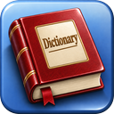

<div align="center">



# Word Helper

**Look up any word in Google Docs without leaving the document.**

Select a word, click the pill that appears, and get its definition, pronunciation,
and part of speech — plus one-click synonyms that replace the word in place.

</div>

---

## Demo

<!-- Record ~10s of select -> pill -> card -> synonym swap, run it through
     `python assets/optimize_gif.py docs/raw.gif docs/demo.gif`, then delete
     these two lines and uncomment the image below. -->
<!--  -->

*Screen recording coming soon.*

---

## Features

- **Non-intrusive trigger.** Select a word and a small pill appears beside it; click it (or hover for 300 ms) to open the card. Double-click deliberately does *nothing* — that's Google Docs' own select-a-word gesture, and hijacking it interrupted ordinary editing.
- **One-click synonym replacement.** Click a synonym and it replaces the selected word directly in the document, matching the original capitalisation and preserving a trailing space.
- **Never touches your clipboard.** Reading the selection out of Google Docs requires provoking a copy, so the extension intercepts it before anything reaches the OS clipboard. Details below.
- **Four popup themes**, chosen from the toolbar button.
- **Resilient lookups.** If the primary dictionary is slow or down, it falls back to Datamuse within 3 seconds and skips the primary for five minutes, so only the first lookup of an outage waits.
- **Keyboard and context-menu access** — `Alt+Shift+D`, or right-click → *Look up "…"*.

### Themes

| Theme | Look |
|---|---|
| **Modern Glass** *(default)* | Blue-white gradient, rendered in a shadow root |
| **Old Dictionary** | Parchment and serif type |
| **Liquid Glass** | Live refraction of the page behind the card, with chromatic fringing at the rim |
| **Frosted Glass** | `backdrop-filter` blur on the card itself |

---

## Install

Not yet on the Chrome Web Store. To run it locally:

1. Clone or download this repository.
2. Open `chrome://extensions` and switch on **Developer mode**.
3. Click **Load unpacked** and select the project folder.
4. Open any Google Doc and select a word.

---

## How it works

The interesting problems here aren't the dictionary lookup — they're getting text
*out of* Google Docs and putting a synonym back *into* it.

### Reading the selection without touching the clipboard

Google Docs renders its document to canvas, so there is no DOM text node to read
and `window.getSelection()` is usually empty. The only reliable way to get the
selected text is to trigger a copy — but silently overwriting the user's
clipboard every time they select a word is unacceptable.

The fix is a two-layer interception:

1. **`content-main.js`** runs in the page's MAIN world at `document_start`, early
   enough to patch `DataTransfer.prototype.setData` before Docs' own scripts
   load. When a flag attribute is set on `<html>`, it stashes the text in a DOM
   attribute instead of forwarding it to the native `DataTransfer`, so the C++
   backing store stays empty.
2. **`content.js`** (isolated world) sets that flag, fires
   `execCommand('copy')`, and calls `preventDefault()` on the copy event in the
   capture phase to block the browser's native-selection fallback.

Docs still calls `setData()` and the text is still readable — but the backing
store is empty and the default is prevented, so nothing is ever committed to the
system clipboard.

### Coordinating across frames

The Docs editor lives in an iframe, while the popup must render in the top frame.
The two coordinate over a `BroadcastChannel`: the iframe that owns the selection
announces the word it found, and the top frame renders the card. A `direct` flag
rides along on those messages so an explicit trigger (`Alt+Shift+D`, context
menu) skips the pill and opens the card immediately, while a plain selection
stops at the pill.

Selection probing is debounced and gated — a mouseup only counts if the pointer
dragged at least 3 px or it was a multi-click — so a plain caret click never
fires the `execCommand`-based read.

### Writing the synonym back

Replacement dispatches a synthetic `paste` `ClipboardEvent` at the editor. A
trailing space needs separate handling: pasting `" "` gets trimmed, and
`execCommand` is intercepted, so the extension dispatches a `keydown`/`keypress`/
`keyup` triple for Space and lets Docs' own key handler insert it into the model.

### Liquid glass without a screenshot

Chromium lets `backdrop-filter` reference an SVG filter, so the browser itself
refracts the live page behind the card — no tab capture, no WebGL texture, and
no broad host permission, and it stays correct while the page scrolls.

The filter chain:

1. **A displacement map** is generated once from the card's signed distance
   field: neutral grey across the face, bending inward toward the rim with a
   circular-bezel falloff. Sampling inward keeps every lookup inside the card's
   own box, so the filter region never clips.
2. **A light blur** frosts the face just enough to keep the card text legible.
3. **Three `feDisplacementMap` passes** at 1.2× / 1.0× / 0.8× strength, one per
   colour channel, recombined with `feComposite` — chromatic aberration at the
   rim.
4. **A mild saturation lift.** Kept low on purpose: pushed harder, the colour
   split turns table rules running parallel to the rim into hard stripes.

The filter has to sit on the card element itself. `.wh-popup` sets
`isolation: isolate`, which makes it a backdrop root — on a child, the same
filter would only ever see the card's own interior. That confound once made it
look as though Chrome ignored displacement inside `backdrop-filter` entirely.

### Motion

The card springs out of the pill: its `transform-origin` is the pill's centre,
and the scale runs on a damped spring (ζ = 0.68, ~5% overshoot at 0.29 s, at
rest by 0.6 s) sampled into CSS `linear()`, so it is a real spring response
rather than a bezier imitation. Content trails the shell, the definition
cross-fades in over the spinner, and `prefers-reduced-motion` reduces it all to
a fade.

---

## Permissions

| Permission | Why |
|---|---|
| `storage` | Remember the selected theme |
| `contextMenus` | The right-click *Look up "…"* entry |

That's the whole list — no host permissions. The content scripts run only on
`https://docs.google.com/document/*`, declared in `content_scripts`, so the only
site access Chrome shows at install is Google Docs.

No analytics, no tracking, no account. The only network requests are for the
word you looked up — to `api.dictionaryapi.dev`, and to `api.datamuse.com` as a
fallback. Neither needs a permission: in Manifest V3 a content script's requests
follow the page's CORS rules, and both APIs allow Google Docs.

---

## Development

No build step — it's plain JavaScript loaded directly by Chrome.

| Path | Role |
|---|---|
| `content.js` | Triggers, pill, card, cross-frame coordination, dictionary lookup, liquid glass filter |
| `content-main.js` | MAIN-world `setData` patch |
| `content.css` | All popup and pill styles |
| `background.js` | Service worker: the context menu |
| `popup.html` / `popup.js` | Theme picker |
| `assets/make_icon.py` | Regenerates `icon16/48/128.png` |

### Regenerating the icons

```sh
python assets/make_icon.py
```

Crops `assets/icon-source.png` to its tile, masks the surround to transparency at
the tile's corner radius, and writes the three sizes. The mask is downsampled
with `Image.BOX` rather than LANCZOS — ringing on an alpha channel pushes edge
values past 0/255. Requires Pillow.

---

## Credits

Definitions from [Free Dictionary API](https://dictionaryapi.dev/) and
[Datamuse](https://www.datamuse.com/api/).

## License

[MIT](LICENSE)
